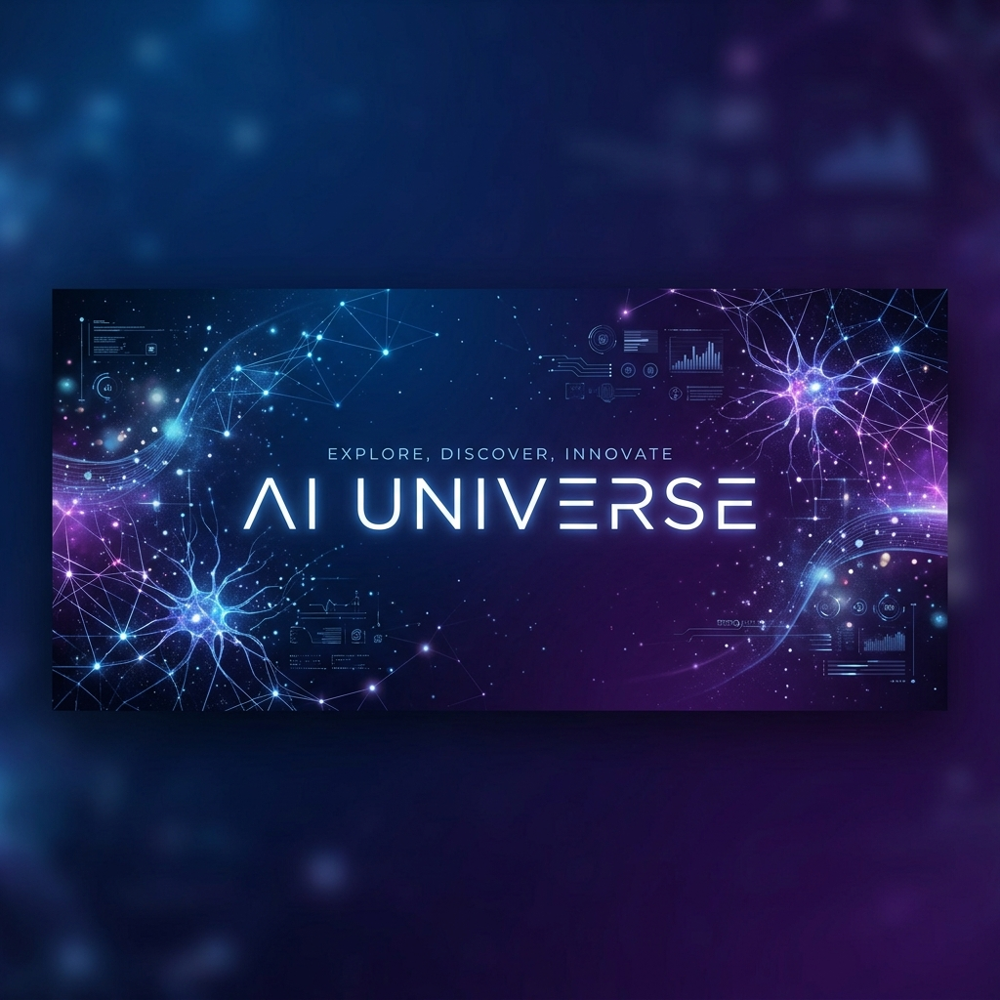

<div align="center">

# 🌌 AI Universe



**A curated collection of world-class Artificial Intelligence and machine learning experiments.**

[](https://www.python.org/)
[](LICENSE)
[](https://github.com/)
[](https://github.com/)

---

[Explore Projects](#-project-categories) • [Installation](#-quick-start) • [Tech Stack](#-technology-stack) • [Contributing](#-contribution)

</div>

## 🚀 Overview

Welcome to the **AI Universe**, an elite-tier research ecosystem and high-performance laboratory housing a comprehensive collection of mission-critical AI notebooks. Spanning deep clinical diagnostics, sophisticated financial forecasting, and next-generation generative synthesis, this repository is engineered to serve as an ever-expanding bridge between theoretical research and state-of-the-art implementation.

## 📂 Project Categories

Browse our experiments by domain. Each project includes a dedicated notebook and dataset integration.

### 🏥 Healthcare & Medical Diagnostics
Precision AI for medical imaging and patient data analysis.
- **[Brain-Tumor-Detection](file:///e:/00%20Projects/AI-Universe/Healthcare-Medical-AI/Brain-Tumor-Detection)**: Neural MRI analysis for 4 tumor classes.
- **[Breast-Cancer-Prediction](file:///e:/00%20Projects/AI-Universe/Healthcare-Medical-AI/Breast-Cancer-Prediction)**: Diagnostic classification using clinical features.
- **[Chest-Disease-Detection](file:///e:/00%20Projects/AI-Universe/Healthcare-Medical-AI/Chest-Disease-Detection)**: Deep learning on X-ray imaging.
- **[Diabetes-Disease-Detection](file:///e:/00%20Projects/AI-Universe/Healthcare-Medical-AI/Diabetes-Disease-Detection)**: Risk forecasting with SVM and Ensemble models.
- **[Heart-Disease-Prediction](file:///e:/00%20Projects/AI-Universe/Healthcare-Medical-AI/Heart-Disease-Prediction)**: Cardiovascular risk assessment.
- **[Kidney-Disease-Detection](file:///e:/00%20Projects/AI-Universe/Healthcare-Medical-AI/Kidney-Disease-Detection)**: Early detection of renal pathologies.
- **[Leukemia-Disease-Detection](file:///e:/00%20Projects/AI-Universe/Healthcare-Medical-AI/Leukemia-Disease-Detection)**: Blood smear cell classification.
- **[Liver-Disease-Prediction](file:///e:/00%20Projects/AI-Universe/Healthcare-Medical-AI/Liver-Disease-Prediction)**: Metric-based liver condition forecasting.
- **[Lung-Disease-Detection](file:///e:/00%20Projects/AI-Universe/Healthcare-Medical-AI/Lung-Disease-Detection)**: Respiratory ailment identification.
- **[Malaria-Disease-Detection](file:///e:/00%20Projects/AI-Universe/Healthcare-Medical-AI/Malaria-Disease-Detection)**: Parasite detection in microscopic images.
- **[Parkinsons-Disease-Detection](file:///e:/00%20Projects/AI-Universe/Healthcare-Medical-AI/Parkinsons-Disease-Detection)**: Voice-driven neurodegenerative diagnosis.

### 📈 Regression & Financial Forecasting
Advanced predictive models for market and price estimation.
- **🖼️ [Aerial-Fare-Predictor](file:///e:/00%20Projects/AI-Universe/Regression-Forecasting/Aerial-Fare-Predictor)**: *Premium* Airfare forecasting model using route-deep analytics.
- **[Airbnb-Price-Prediction](file:///e:/00%20Projects/AI-Universe/Regression-Forecasting/Airbnb-Price-Prediction)**: Extensive market valuation (74k+ entries).
- **[Diamond-Price-Prediction](file:///e:/00%20Projects/AI-Universe/Regression-Forecasting/Diamond-Price-Prediction)**: 4C-based gemstone valuation.
- **[Gold-Price-Prediction](file:///e:/00%20Projects/AI-Universe/Regression-Forecasting/Gold-Price-Prediction)**: Time-series precious metal forecasting.
- **[House-Price-Prediction](file:///e:/00%20Projects/AI-Universe/Regression-Forecasting/House-Price-Prediction)**: Real estate multi-regression analysis.
- **[Wine-Quality-Prediction](file:///e:/00%20Projects/AI-Universe/Regression-Forecasting/Wine-Quality-Prediction)**: Physicochemical quality scoring.

### ✍️ Natural Language Processing (NLP)
Conversational AI and linguistic feature extraction.
- **[Book-Recommendation-System](file:///e:/00%20Projects/AI-Universe/NLP-Text-Analysis/Book-Recommendation-System)**: Collaborative filtering Hub.
- **[Hate-Speech-Detection](file:///e:/00%20Projects/AI-Universe/NLP-Text-Analysis/Hate-Speech-Detection)**: Robust content moderation classifier.
- **[Medical-Chatbot](file:///e:/00%20Projects/AI-Universe/NLP-Text-Analysis/Medical-Chatbot)**: Virtual assistant for healthcare research.
- **[Spam-Email-Detection](file:///e:/00%20Projects/AI-Universe/NLP-Text-Analysis/Spam-Email-Detection)**: NLP-based inbox filter.
- **[Script-Correction](file:///e:/00%20Projects/AI-Universe/NLP-Text-Analysis/Script-Correction)**: Automatic grammar and style polishing.

### 👁️ Computer Vision & Generative AI
Next-gen image processing and model synthesis.
- **🎨 [Image-Generation-DALLE](file:///e:/00%20Projects/AI-Universe/Computer-Vision-Generative/Image-Generation-DALLE)**: Synthesizing art using DALL-E models.
- **[Optical-Character-Recognition](file:///e:/00%20Projects/AI-Universe/Computer-Vision-Generative/Optical-Character-Recognition)**: High-accuracy document digitization.

### 📊 General Classification & Core ML
Benchmark experiments on structured datasets.
- **[Mushroom-Classification](file:///e:/00%20Projects/AI-Universe/General-Classification/Mushroom-Classification)**, **[Rock-and-Mine-Classification](file:///e:/00%20Projects/AI-Universe/General-Classification/Rock-and-Mine-Classification)**, **[Student-Performance-Prediction](file:///e:/00%20Projects/AI-Universe/General-Classification/Student-Performance-Prediction)**, **[Titanic-Survival-Prediction](file:///e:/00%20Projects/AI-Universe/General-Classification/Titanic-Survival-Prediction)**, **[US-Visa-Approval-Prediction](file:///e:/00%20Projects/AI-Universe/General-Classification/US-Visa-Approval-Prediction)**.

### 🛠️ Automation & Strategic Tools
- **[Article-Web-Scraping](file:///e:/00%20Projects/AI-Universe/Automation-Utility-Tools/Article-Web-Scraping)**, **[Git-Repo-Cloning](file:///e:/00%20Projects/AI-Universe/Automation-Utility-Tools/Git-Repo-Cloning)**, **[Image-Scraper](file:///e:/00%20Projects/AI-Universe/Automation-Utility-Tools/Image-Scraper)**, **[Password-Strength-Prediction](file:///e:/00%20Projects/AI-Universe/Automation-Utility-Tools/Password-Strength-Prediction)**, **[QR-Code-Generator](file:///e:/00%20Projects/AI-Universe/Automation-Utility-Tools/QR-Code-Generator)**.

## 🛠️ Technology Stack

<div align="center">


</div>

## 📥 Quick Start

To run these experiments locally:

1. **Clone the repository**
   ```bash
   git clone https://github.com/your-username/AI-Universe.git
   cd AI-Universe
   ```

2. **Set up virtual environment**
   ```bash
   python -m venv venv
   source venv/bin/activate  # On Windows: venv\Scripts\activate
   ```

3. **Install dependencies**
   ```bash
   pip install -r requirements.txt
   ```

4. **Launch Jupyter**
   ```bash
   jupyter notebook
   ```

---

<p align="center">Created with ❤️ for the AI Community</p>